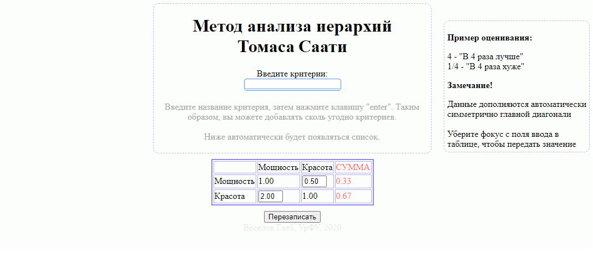

# Описание:
Программа построена по стандартному шаблону простых сайтов (html, css) и работает на чистом *JavaScript*. Введенный через клавишу *Enter* список критериев выстраивается в виде симметричной таблицы, где в появившихся полях можно ввести необходимые значения, после чего нажать на кнопку *"Вычислить"* под таблицей, чтобы получить результирующую сумму.

# Открытие и использование:
* Необходимо открыть файл ___index.html___, чтобы запустить программу. Откроется бразуер, где в новой вкладке будет находиться интерфейс программы, показанный на скриншоте выше. 
*желательно открывать через браузер Google Chrome либо Yandex*

* Перед вами весь доступный функционал, под строчкой *"Введите критерии:"* в форме ввода на центральной панельке введите желаемый критерий, после чего нажмите клавишу *Enter*, чтобы добавить критерий в список и сформировать таблицу под данным блоком.
* В таблице с появлением необходимых критериев автоматически будут образовываться пустые ячейки, в которые нужно ввести желаемые относительные оценки (ячейки, в которых ничего нет, имеют значение *0*). Программа автоматически редактирует дроби в десятичный вид.
* После ввода 2-х или более критериев станет доступна кнопка *"Вычислить"*, которая расположилась прямо под таблицей. Нажатие на неё создаст дополнительную колонку в таблице - *"Сумма"*, ниже будут вычислены результирующие суммы сравнений. При этом данная кнопка изменит назване на *"Перезаписать"*.
* Нажатие на кнопку *"Перезаписать"* полностью удалит таблицу и записанный список критериев.

# Среда программирования: 
Программа построена на чистом JavaScript с использованием разметки html и стилей css. Открывать можно в любом удобном редакторе, который поддерживает данные форматы файлов, для примера, *Visual Code Studio*, *Notepad++* или *блокнот*. Весь пользовательский интерфейс представлен в файле index.html, через него и осуществляется управление программой. Вся введенная информация берётся автоматически с интерфейса с помощью js/main.js, полученная информация обрабатывается через конструктор класса в файле js/ControlTable.js, который содержит функции для создания и удаление таблицы, а также для вывода суммы. Результат обработки поступает в main.js. В свою очередь main.js реактивным образом отображает информацию в интерфейсе пользователя.